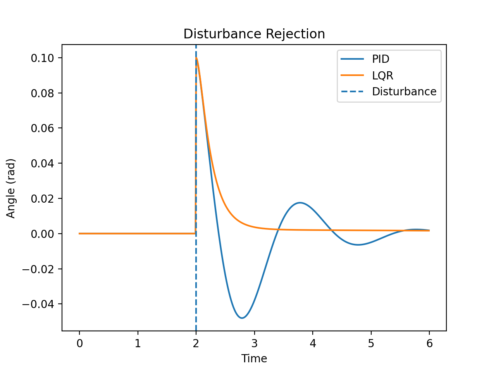
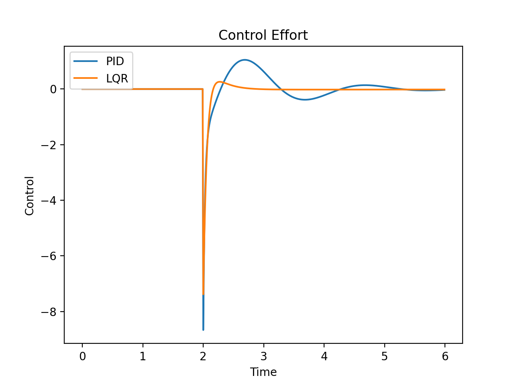

# Self-Balancing Control System — Engineering Validation

## Overview

This repository demonstrates a simple, reproducible control-systems validation for an unstable system analogous to a self-balancing robot (inverted pendulum). The project compares **PID** and **LQR** controllers using a linearized plant model and simulation-based analysis.

The focus is on **what was done, how it was validated, and what the results show**.

---

## What is implemented

* Linearized self-balancing plant model (config-driven)
* PID controller (classical feedback baseline)
* LQR controller (optimal state-feedback)
* Time-domain simulation with impulse disturbance
* Logged results and comparison plots

---

## How to run

From the repository root:

```bash
python -m src.simulation.compare_pid_vs_lqr
python scripts/plot_comparison.py
```

This generates simulation logs and the plots shown below.

---

## Results

### Disturbance rejection (angle vs time)



* Both controllers stabilize the system after a 0.1 rad disturbance.
* PID shows overshoot and oscillatory recovery.
* LQR returns the system to equilibrium smoothly with faster settling.

---

### Control effort (control input vs time)

 (plots/pid_vs_lqr_u.png)

* PID produces large, oscillatory control inputs.
* LQR achieves stabilization with smoother and lower control effort.

---

## Conclusion

* PID provides a simple and robust baseline but results in oscillatory transients.
* LQR delivers better damping and control efficiency when an accurate plant model is available.

This comparison reflects trade-offs between classical and optimal control approaches.

---

## Reference Papers

* Jian Fang, The LQRController Design of Two‑Wheeled Self‑Balancing Robot Based on the Particle Swarm Optimization Algorithm (2014).

* Huaqiang Zhang & Norzalilah MohamadNor, Control Strategies for Two‑Wheeled Self‑Balancing Robotic Systems: A Comprehensive Review.

---

## License

MIT License
