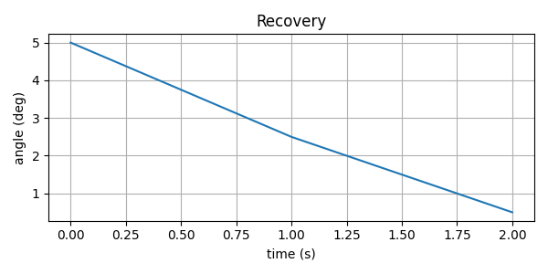

# Self-Balancing Control — First‑Order Prototype

Purpose

A focused engineering prototype that validates the closed‑loop control pipeline end‑to‑end. It uses a first‑order plant intentionally to prove the software and integration before adding physics or hardware.

What it is

• Deterministic control pipeline: sensor → filter → PID → actuator with reproducible logs and plots.
• Clear separation between controller logic, simulation, and visualization.
• A deliberate engineering checkpoint to reduce integration risk.

What it is not

• Not a full inverted‑pendulum dynamics model.
• Not a hardware validation or production system.
• Not an optimal control benchmark.

Why this design

Keep the scope minimal to validate interfaces, data flow, and reproducibility. This reduces risk when moving to higher‑fidelity models or MCU deployment.

Quickstart (exact)

Windows (PowerShell):

```
py -3.12 -m venv venv
.\venv\Scripts\Activate.ps1
python -m pip install --upgrade pip setuptools wheel
pip install -r requirements.txt
```

Linux/mac:

```
python3.12 -m venv venv
source venv/bin/activate
python -m pip install --upgrade pip setuptools wheel
pip install -r requirements.txt
```

Run simulation (creates `data/sample_logs.csv`):

```
python src/simulation/task1b_pid_balance_controller.py
```

Plot results:

```
python scripts/plot_logs.py data/sample_logs.csv out/plot.png
```

Repo surface (key files)

• `src/control/lib/pid.py` — PID implementation (anti‑windup, derivative handling)
• `src/simulation/task1b_pid_balance_controller.py` — first‑order simulation + demo
• `scripts/plot_logs.py` — plot generator
• `tests/` — basic sanity tests (run with `pytest`)

Next steps:

Upgrade the toy first‑order demo into a real second‑order inverted‑pendulum simulation, demonstrate disturbance → overshoot → correction → settle, compare PID vs LQR, add deterministic ensemble tests, latency instrumentation, and polished artifacts (plots, GIF, short demo).

Reference Papers 

• Jian Fang, *The LQRController Design of Two‑Wheeled Self‑Balancing Robot Based on the Particle Swarm Optimization Algorithm* (2014).

• Huaqiang Zhang & Norzalilah MohamadNor, *Control Strategies for Two‑Wheeled Self‑Balancing Robotic Systems: A Comprehensive Review*.

License: MIT
